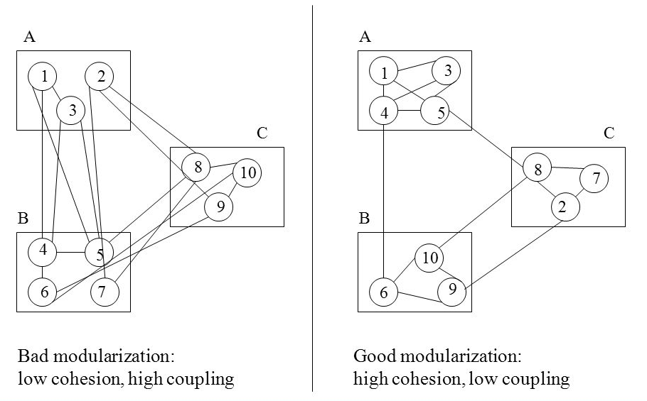

# Co to jest zależność

* Powiązanie pomiędzy jednostkami kodu.
* Miarą zależności jest tzw. Coupling.
* Mądrze wprowadzone zależności są dobre.
* Cohesion - miara spójności

---
# Przykłady w kodzie ...