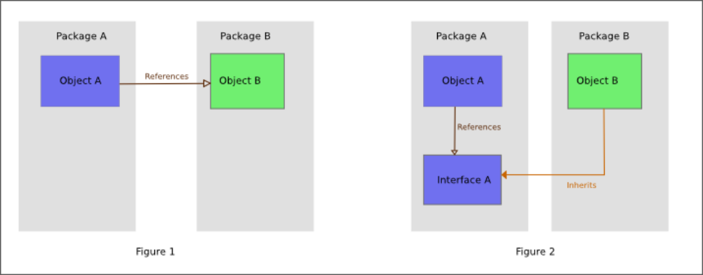

# Dependency inversion principle
## **D** z zasad SOLID

* Wysokopoziomowe moduły nie powinny importować nic z niskopoziomowych modułów.
* Abstrakcje nie powinny zależeć od szczegółów implementacyjnych. Szczegóły implementacyjne powinny zależeć od abstrakcji.

# Przykłady w kodzie...